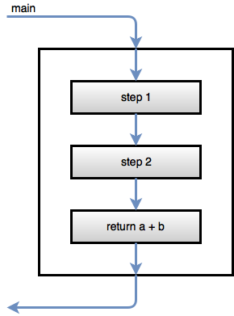

# An introduction to Kotlin Coroutines #

## Motivation ##


## Coroutines and Suspendable functions ##

Let's start with a simple function

```Kotlin
fun simpleFunction(a: Int, b: Int): Int {
    log.info("step 1")
    log.info("step 2")
    return a + b
}
```

that takes some parameters, performs two steps, represented by the `info` calls, and returns a value.
Calling this function in our `main` function

```Kotlin
fun main(args: Array<String>) {
    log.info("main started")
    log.info("result is {}", simpleFunction(40, 2))
    log.info("main ended")
}
```

produces the following

```shell
8 [main] INFO intro - main started
9 [main] INFO intro - step 1
9 [main] INFO intro - step 2
10 [main] INFO intro - result is 42
10 [main] INFO intro - main ended
```

The value between brackets contains the name of the threads where the `info` calls were performed: in this case all were performed on the `main` thread (the one that calls the `main` method).

The following diagram illustrates the execution of `simpleFunction`, where all the statements are executen in the `main` thread.



Now, suppose that between `step 1` and `step 2` we need to wait for something to happen, such as receiving a message of an external system or waiting for a time period to elapse.
To keep things simple that illustrate that using a simple `Thread.sleep`

```Kotlin
fun simpleFunctionWithDelay(a: Int, b: Int): Int {
    log.info("step 1")
    Thread.sleep(1000);
    log.info("step 2")
    return a + b
}
```

Running this function from our main function produces the following output

```shell
7 [main] INFO intro - main started
8 [main] INFO intro - step 1
1011 [main] INFO intro - step 2
1012 [main] INFO intro - result is 42
1012 [main] INFO intro - main ended
```

Again, all the statements are run on the `main` thread, which blocks for 1000 ms between `step 1` and `step 2`.


However, blocking threads may not be a good thing:

* On client applications (e.g. Android application), if the thread is the UI thread then the application will become unresponsive during the blocking period.

* On server applications, blocking threads will reduce the number of requests that can be served simultaneously.

Kotlin **suspendable** functions provide us with a way of handling these pauses in a sequential flow without blocking the hosting thread by allowing a function 
* to suspend its execution and free up the hosting thread.
* resume its execution in a future point in time, potentially on a different thread.

So, lets convert the previous `simpleFunctionWithDelay` example to a suspendable function that does not block the hosting thread while waiting for 1000 ms to elapse.

```Kotlin
suspend fun suspendFunctionWithDelay(a: Int, b: Int): Int {
    log.info("step 1")
    suspendCoroutine<Unit> { cont ->
        executor.schedule(
          { cont.resume(Unit) }, 
          1000,TimeUnit.MILLISECONDS)
    }
    log.info("step 2")
    return a + b
}
```

The first thing to notice is that a suspendable function declaration is prefixed with the `suspend` keywords.
However, the remaining function signature remains unchanged: it still receives two integers and returns an integer.

Looking into the function body we notice that it remains unchanged, except for the `Thread.sleep` call that was replaced by a call to `suspendCoroutine`.

The `suspendCoroutine` is provided by the Kotlin coroutine library and is used to suspend the current function.
However, when calling it we must pass a function that defines *how* and *when* the suspended function will be resumed.
This done by providing the `suspendCoroutine` with a function that receives a *continuation*, which is a Kotlin interface defined as 

```Kotlin
public interface Continuation<in T> {
    /**
     * Resumes the execution of the corresponding coroutine passing [value] as the return value of the last suspension point.
     */
    public fun resume(value: T)

    /**
     * Resumes the execution of the corresponding coroutine so that the [exception] is re-thrown right after the
     * last suspension point.
     */
    public fun resumeWithException(exception: Throwable)

    /**
     * Context of the coroutine that corresponds to this continuation.
     */
    public val context: CoroutineContext
}
```

Ignoring the `context` field for the moment being, a `Continuation<T>` has two functions: the `resume` function, to be called if the suspendable function should resume normally with a value; and the `resumeWithException` function to be called if the suspendable function should resume with an exception.

Since in our example we just want to wait for 1000 ms to elapse,we use a plain Java `ScheduledExecutorService` 
```Kotlin
val executor = Executors.newScheduledThreadPool(1)
```

to schedule the execution of the continuation after 1000 ms.
```Kotlin
suspendCoroutine<Unit> { cont ->
        executor.schedule(
          { cont.resume(Unit) }, 
          1000,TimeUnit.MILLISECONDS)
    }
```

The following diagram illustrates this suspension and resumption.


The `suspendCoroutine` function calls the passed in user function, which schedules the `cont.resume(Unit)` to be run in 1000 ms, and then terminates, freeing up the main thread (in green color).

After the 1000 ms elapse, a thread from the scheduled pool calls `cont.resume(Unit)`, resuming the execution of the `suspendFunctionWithDelay`.

This suspension and resumption, including the switch between threads, is visible in the program output 

```shell
8 [main] INFO intro - main started
20 [main] INFO intro - step 1
24 [main] INFO intro - main ended
1027 [pool-1-thread-1] INFO intro - step 2
1029 [pool-1-thread-1] INFO intro - result is 42
```

Notice that the `main` function ends immediately after `step 1`, without waiting for the 1000 ms to elapse, because `suspendFunctionWithDelay` suspended its execution and *returns* to the `main` function.
After the 1000 ms elapses, the `suspendFunctionWithDelay` resumes its execution in the `pool-1-thread-1` (a thread from the scheduled pool) and `step 2` is executed.  


